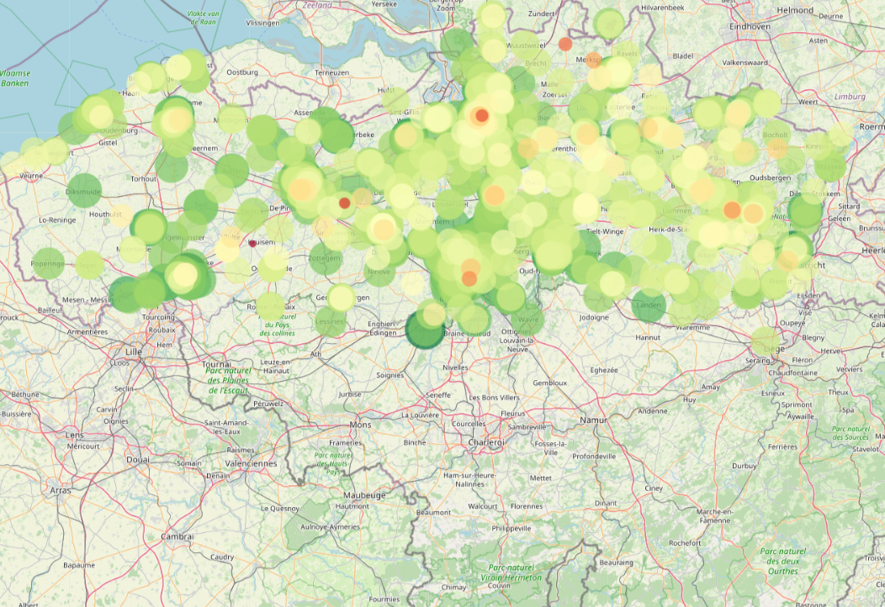
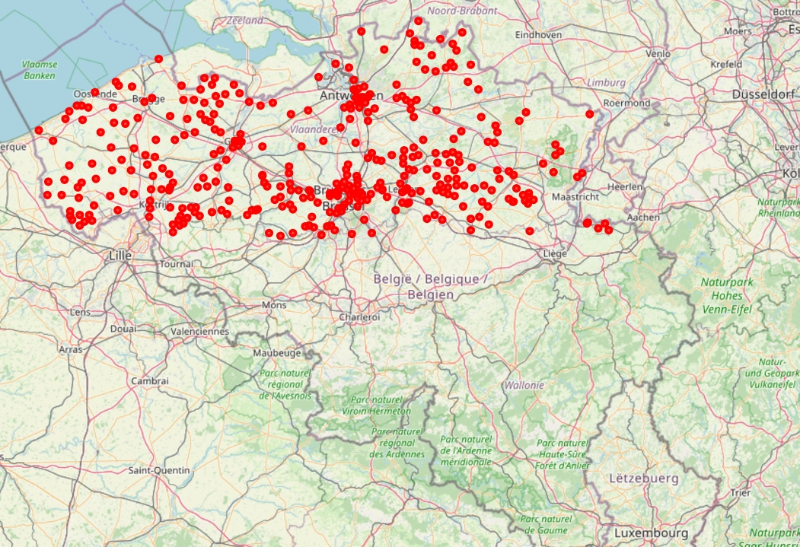
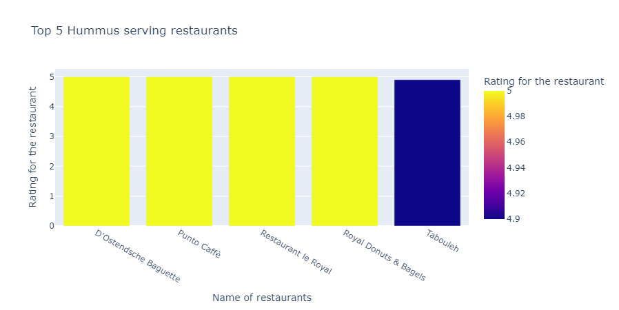

## Delivery Market Analysis

This analysis investigates the food delivery market in Belgium by examining data from the leading platforms: **Deliveroo**, **Takeaway**, and **UberEats**. The goal is to provide actionable insights to help consumers make informed decisions when ordering food. By understanding platform offerings, pricing trends, and distribution of restaurants, this analysis aims to simplify the decision-making process for users and improve their overall food delivery experience.

---

## Description

The food delivery industry has revolutionized the way people access their favorite meals, offering convenience and a diverse range of options at their fingertips. This project focuses on analyzing the platforms used in Belgium to better understand:  

- **Consumer Preferences**: Identifying top-rated restaurants across key food categories to help users discover the best options available.  
- **Platform Comparisons**: Evaluating the strengths and weaknesses of each platform (e.g., pricing, delivery price, price to rating corelation).  
- **Regional Insights**: Exploring trends in different cities and areas within Belgium to highlight regional distribution and gaps in service.  

By providing a clear overview of these platforms and their data, this project helps consumers enjoy a seamless food delivery experience tailored to their needs.  

Whether you're choosing between platforms or curious about trends in food delivery, this analysis aims to make navigating Belgium’s food delivery market easier and more enjoyable.


## Repo structure
```
├── Delivery Market Analysis
│
├── assets/
│   ├── ER_ER_schema_deliveroo.png
│   ├── ER_ER_schema_takeaway.png
│   ├── ER_ER_schema_takeaway.png
│   ├── All Analysis images   
├── .gitignore
├── code-spaces
│   ├── notebook.ipynb 
├── databases
│   ├── deliveroo.db
│   ├── takeaway.db
│   ├── ubereats.db
├── README.md
├── requirements.txt

```
## Sample of Analysis - Screenshots
In this section you will find our analysis on three major food delivery apps in Belgium namely Deliveroo, Takeaway and Uber Eats.

1. The following analysis gives you an idea about the total restaurants, their distribution across city and various platforms used for food delivery.

| Distribution of restaurants across Belgium  |
|-------------------------------------------|
|                |
------------------------------------------------

| Total restaurants Exclusive count | Number of restaurants by platforms and city|
|---------------------------------  |  -----------------------------------------|
|       |                |

| Kapsalon price distribution heatmap| Restauarant distribution dead zones        |
|------------------------------------|--------------------------------------------|
|         |              |


2. If you love Pizza and Hummus, Here are the top restaurants based on ratings which you can checkout.

| Top 10 pizza restaurants          |    Top 5 Hummus Restuarants                |
|-----------------------------------|--------------------------------------------|
|   |        |  
---------------------------------------------------------------------------------

3. If you are a vegetarian. Here is the informations needed for you to pick your dishes

| Information on vegetarian dishes and restaurants|
|-------------------------------------------------|
|             |

4. A more deeper analysis in to the ratings of restaurants and thier prices can be seen below.

| Restaurants rating by service and city |   Relation between rating and delivery fees|
|----------------------------------------|--------------------------------------------|
|  |       |

| Overlapping resatuarants across platforms| Price Distribution of delivery services |
|-----------------------------------------|-------------------------------------------|
|             |     |
---------------------------------------------------------------------------------------

## Database

This project utilizes a structured database (`SQLite`) to manage and organize the data efficiently.

### Data Overview
- All data used for this project is contained in the '`databases` folder.
- Schema diagrams illustrating the database structure can be found in the `assets` folder.

### Database Enhancements
Several improvements were made to enhance the database's integrity, readability, and performance:

1. **Establishing Missing Relationships**  
   - Previously, some relationships between related tables were missing.  
   - Foreign keys were added to create proper connections between these tables, enabling more efficient and accurate queries.

2. **Improving Naming Conventions**  
   - Certain tables and fields, such as the `takeaway` table, did not follow proper naming conventions.  
   - These names were updated to adhere to standard conventions, making the database easier to understand and maintain.

3. **Correcting Postal Code Values**  
   - Some postal code entries contained unreadable or incorrect values.  
   - These values were corrected to ensure data consistency and reliability.

By addressing these issues, the database is now more robust, query-friendly, and aligned with best practices.


## ⏱️ Timeline

This project took 5 days for completion.
Team project.

## 📌 Personal Situation
This project was done as part of the AI Boocamp at BeCode.org. 

**Team:**
Connect with Adeeba  on [LinkedIn/adheeba](https://www.linkedin.com/in/adheeba-thahsin-3950a5127/).<br>
Connect with Levin on [LinkedIn/levin](https://www.linkedin.com/in/).<br>
Connect with Marten on [LinkedIn/maarten](https://www.linkedin.com/in/maarten-warnez-007556329/).<br>
Connect with Soha on [LinkedIn/soha](https://www.linkedin.com/in/soha-mohamad-382b44219/).<br>